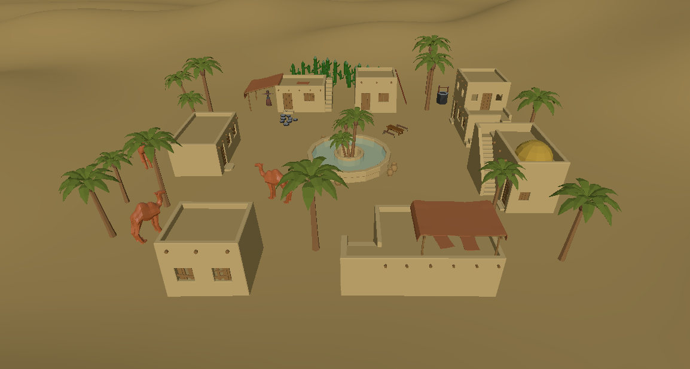

# Projet VR – Aventure dans le désert

## Présentation

Ce projet Unity propose une **expérience immersive en réalité virtuelle** sur Meta Quest 2/3, conçue avec **Unity**, **XR Interaction Toolkit** et **Normcore**. Le joueur évolue dans un village désertique mystérieux et interagit avec plusieurs éléments de l’environnement.

  

> 🔗 **Démo vidéo** : [Cliquez ici pour visionner](https://drive.google.com/file/d/1EjNI2h0qy-BdSJVaN7VmMLZ9Fs8ILre6/view?usp=drive_link)  
> 📦 **Repository GitHub** : [Lien vers le repo](https://github.com/Redart71/vr-desert-village)

---

## Membres du binôme

- Étudiant 1 : Arthur JAFFRE 
- Étudiant 2 : Ahmed Ishak BOUGUEROUA
- Étudiant 3 : Thiery Chatelin EBANA AFANA

---

## Fonctionnalités et interactions développées

| Interaction | Description |
|------------|-------------|
| 🎵 Musique | Activation/désactivation de la musique d'ambiance |
| 🐪 Chameau sonore | Approche du chameau déclenche un audio |
| 💡 Maison sombre | Entrer dans une maison éteint la lumière |
| 📦 Téléportation | Touche de l’échelle téléporte le joueur sur un toit |
| 🧙 Voyante interactive | Approcher la voyante fait apparaître une UI avec clavier + input |
| 🌐 Multiplayer | Présence d’un environnement multijoueur via Normcore |
 
---

## Difficultés rencontrées

- Détection du **clavier par les manettes VR** : problématique non résolue à ce jour.
- Gestion du **positionnement précis en téléportation** (ajustements manuels requis).

---

## Ce que nous avons appris

- Utilisation du **XR Interaction Toolkit** pour créer des interactions immersives.
- Intégration de **Normcore** pour le multijoueur VR.
- Configuration des **colliders, triggers et animations** pour les interactions.
- Importation et adaptation d’assets externes (Low Poly Desert Village).

---

## Lancement du projet

1. Ouvrir avec Unity **version 6000.0.41f1 (URP)**
2. Scène : `Scenes/VillageVR`
3. Activez le **mode développeur** sur votre casque Meta Quest
4. Brancher le casque Meta Quest 2/3 via un cable USB
5. Cliquer sur File -> Build Profiles -> Android -> Run Device -> Sélectionner votre casque -> Build and Run

---

## Licence

Ce projet est réalisé dans le cadre pédagogique de l’École Hexagone.  
Usage uniquement académique.